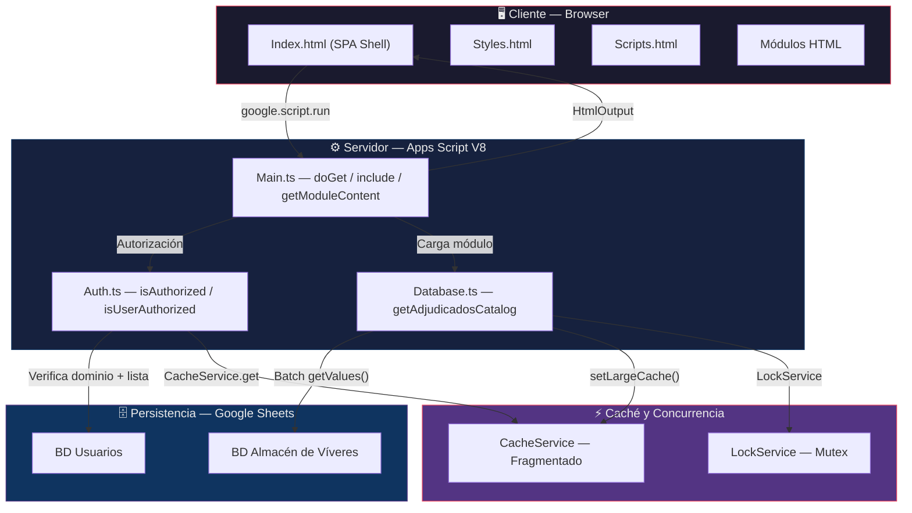
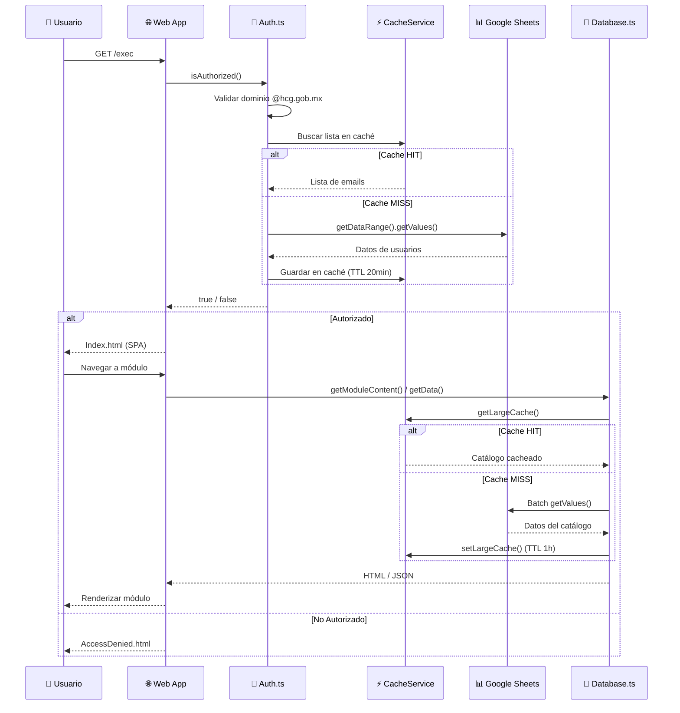
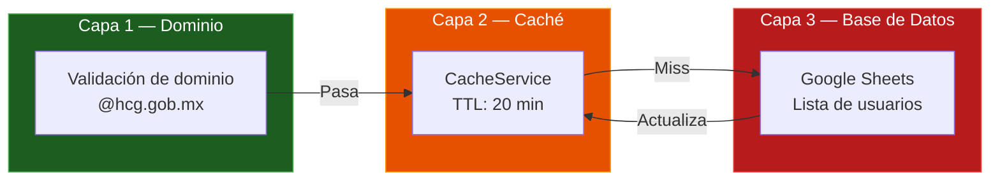

<div align="center">

# 🏥 Almacén de Víveres — HCG

**Sistema de Gestión de Almacén Hospitalario**\
*Hospital Civil de Guadalajara*


---

Aplicación web **SPA** (Single Page Application) desplegada como Web App de Google Apps Script para la gestión integral de insumos, contratos de adjudicación, órdenes de compra y logística del almacén de víveres hospitalario.

[Arquitectura](#-arquitectura) · [Módulos](#-módulos-funcionales) · [Seguridad](#-modelo-de-seguridad) · [Despliegue](#-despliegue) · [Contribuir](#-contribución)

</div>

---

## 📋 Tabla de Contenidos

- [Resumen Técnico](#-resumen-técnico)
- [Stack Tecnológico](#-stack-tecnológico)
- [Arquitectura](#-arquitectura)
- [Estructura del Repositorio](#-estructura-del-repositorio)
- [Módulos Funcionales](#-módulos-funcionales)
- [Modelo de Seguridad](#-modelo-de-seguridad)
- [Patrones de Rendimiento](#-patrones-de-rendimiento)
- [Requisitos Previos](#-requisitos-previos)
- [Instalación y Configuración](#-instalación-y-configuración)
- [Despliegue](#-despliegue)
- [Comandos Útiles](#-comandos-útiles)
- [Contribución](#-contribución)

---

## 🧬 Resumen Técnico

| Característica         | Detalle                                                      |
| :--------------------- | :----------------------------------------------------------- |
| **Tipo de aplicación** | Web App (SPA) desplegada en Google Apps Script                |
| **Runtime**            | V8 Engine (ES2019+)                                          |
| **Lenguaje backend**   | TypeScript → transpilado a `.gs` vía `clasp push`            |
| **Frontend**           | HTML5 + CSS3 + Vanilla JS (inyectado via `HtmlService`)      |
| **Base de datos**      | Google Sheets (batch read/write con `getValues`/`setValues`) |
| **Autenticación**      | OAuth 2.0 institucional + validación de dominio `@hcg.gob.mx`|
| **Caché**              | `CacheService` con fragmentación para payloads > 100 KB      |
| **Concurrencia**       | `LockService.getScriptLock()` para escrituras atómicas        |
| **Logging**            | `console.*` → Google Cloud Logging (Stackdriver)              |

---

## 🛠 Stack Tecnológico

```
┌──────────────────────────────────────────────────────────┐
│                     CLIENTE (Browser)                     │
│  HTML5 · CSS3 · Vanilla JS · google.script.run (async)   │
├──────────────────────────────────────────────────────────┤
│                  SERVIDOR (Apps Script V8)                │
│  TypeScript · HtmlService · SpreadsheetApp · CacheService│
├──────────────────────────────────────────────────────────┤
│               PERSISTENCIA (Google Sheets)                │
│  Usuarios · Adjudicados · Contratos · Inventario         │
└──────────────────────────────────────────────────────────┘
```

<details>
<summary><strong>🔧 Dependencias y Herramientas</strong></summary>

| Herramienta                        | Propósito                                                 |
| :--------------------------------- | :-------------------------------------------------------- |
| **@google/clasp**                  | CLI para desarrollo local, push/pull, y gestión de versiones |
| **TypeScript**                     | Tipado estático, interfaces, y transpilación a `.gs`       |
| **Google Apps Script (V8)**        | Runtime del servidor con soporte ES2019+                   |
| **Google Sheets**                  | Motor de base de datos transaccional (batch R/W)           |
| **CacheService**                   | Caché en memoria con TTL configurable                      |
| **LockService**                    | Mutex distribuido para control de concurrencia              |
| **HtmlService**                    | Renderizado de plantillas HTML con scriptlets               |
| **Google Cloud Logging**           | Monitoreo y trazabilidad de errores en producción           |

</details>

---

## 🏗 Arquitectura

### Diagrama de Flujo de la Aplicación



### Ciclo de Vida de una Solicitud



---

## 📂 Estructura del Repositorio

```
clasp/
├── .clasp.json              # Configuración de clasp (scriptId) — NO versionado
├── .gitignore               # Exclusiones de Git
├── README.md                # Este documento
│
└── src/                     # ── Código fuente ──────────────────────────
    ├── appsscript.json      # Manifiesto GAS (oauthScopes, runtime V8)
    │
    ├── Main.ts              # Entry point: doGet(), include(), getModuleContent()
    ├── Auth.ts              # Autenticación: validación de dominio + caché
    ├── Database.ts          # Acceso a datos: batching + caché fragmentado
    │
    └── ui/                  # ── Capa de Presentación ───────────────────
        ├── Index.html       # Shell principal de la SPA
        ├── Styles.html      # Hoja de estilos global (inyectada via include)
        ├── Scripts.html     # Lógica del cliente (inyectada via include)
        ├── AccessDenied.html# Página de acceso denegado
        │
        └── modules/         # ── Módulos de la SPA ──────────────────────
            ├── Dashboard.html
            ├── Almacenes.html
            ├── Contratos.html
            ├── Entradas.html
            ├── Salidas.html
            ├── Pedidos.html
            ├── OrdenesCompra.html
            ├── Pacientes.html
            ├── Proveedores.html
            ├── Recepciones.html
            └── Servicios.html
```

---

## 📦 Módulos Funcionales

| Módulo              | Archivo                | Estado          | Descripción                                                  |
| :------------------ | :--------------------- | :-------------- | :----------------------------------------------------------- |
| **Dashboard**       | `Dashboard.html`       | ✅ Activo       | Panel principal con métricas, KPIs y actividad reciente       |
| **Almacenes**       | `Almacenes.html`       | ✅ Activo       | Catálogo de artículos adjudicados con filtros avanzados       |
| **Contratos**       | `Contratos.html`       | 🔧 Scaffold    | Gestión de contratos de adjudicación                          |
| **Entradas**        | `Entradas.html`        | 🔧 Scaffold    | Registro de entradas de mercancía al almacén                  |
| **Salidas**         | `Salidas.html`         | 🔧 Scaffold    | Registro de salidas y distribución de insumos                 |
| **Pedidos**         | `Pedidos.html`         | 🔧 Scaffold    | Solicitudes de pedidos por servicios hospitalarios             |
| **Órdenes de Compra** | `OrdenesCompra.html` | 🚧 En desarrollo | Generación y seguimiento de órdenes de compra              |
| **Pacientes**       | `Pacientes.html`       | 🚧 En desarrollo | Registro de pacientes vinculados a consumos                 |
| **Proveedores**     | `Proveedores.html`     | 🚧 En desarrollo | Directorio de proveedores adjudicados                       |
| **Recepciones**     | `Recepciones.html`     | 🚧 En desarrollo | Verificación y recepción de mercancía                       |
| **Servicios**       | `Servicios.html`       | 🚧 En desarrollo | Catálogo de servicios hospitalarios consumidores              |

---

## 🔐 Modelo de Seguridad

La autenticación opera en un modelo de **defensa en profundidad** con tres capas:



| Capa | Mecanismo                      | Detalle                                                                 |
| :--: | :----------------------------- | :---------------------------------------------------------------------- |
| 1    | **Filtro de dominio**          | Solo emails `@hcg.gob.mx` pasan la primera validación                   |
| 2    | **Caché de sesión**            | Lista de emails autorizados en `CacheService` (TTL 20 min)              |
| 3    | **Consulta a Spreadsheet**     | Lectura batch con `LockService` para evitar race conditions              |

### Scopes de OAuth Configurados

```json
[
  "https://www.googleapis.com/auth/spreadsheets.currentonly",
  "https://www.googleapis.com/auth/spreadsheets",
  "https://www.googleapis.com/auth/userinfo.email",
  "https://www.googleapis.com/auth/script.external_request"
]
```

> [!IMPORTANT]
> El archivo `appsscript.json` contiene los scopes mínimos necesarios. **No agregar scopes adicionales** sin revisión de seguridad.

---

## ⚡ Patrones de Rendimiento

### 1. Batch Read/Write (Zero API calls in loops)

```typescript
// ✅ CORRECTO — Una sola llamada a la API
const data = sheet.getDataRange().getValues();
const processed = data.slice(1).map(row => transform(row));
sheet.getRange(2, 1, processed.length, processed[0].length).setValues(processed);

// ❌ INCORRECTO — N llamadas a la API
for (let i = 0; i < rows; i++) {
  sheet.getRange(i, 1).getValue(); // ← Llamada por iteración
}
```

### 2. Caché Fragmentado (Payloads > 100 KB)

```typescript
// CacheService tiene un límite de 100 KB por clave.
// El sistema fragmenta automáticamente los datos en chunks de 90 KB:
setLargeCache(key, JSON.stringify(largeData), 3600);  // Escritura
const data = getLargeCache(key);                        // Lectura
```

### 3. Concurrencia Segura

```typescript
const lock = LockService.getScriptLock();
if (lock.tryLock(30000)) {
  try {
    // Operación atómica sobre datos compartidos
  } finally {
    lock.releaseLock();
  }
}
```

---

## 📋 Requisitos Previos

| Requisito              | Versión mínima | Verificación                    |
| :--------------------- | :------------- | :------------------------------ |
| **Node.js**            | 18 LTS         | `node --version`                |
| **npm**                | 9.x            | `npm --version`                 |
| **@google/clasp**      | 2.4+           | `clasp --version`               |
| **Cuenta Google**      | —              | Dominio `@hcg.gob.mx`          |
| **Apps Script API**    | Habilitada     | [script.google.com/home/usersettings](https://script.google.com/home/usersettings) |

---

## 🚀 Instalación y Configuración

### 1. Clonar el repositorio

```bash
git clone <url-del-repositorio>
cd clasp
```

### 2. Instalar Clasp (si no está instalado)

```bash
npm install -g @google/clasp
```

### 3. Autenticarse con Google

```bash
clasp login
```
> Esto abrirá una ventana del navegador para autorizar el acceso a tu cuenta de Google.

### 4. Vincular al proyecto de Apps Script

```bash
# Opción A: Crear un nuevo proyecto
clasp create --title "Almacen Viveres HCG" --type sheets --rootDir ./src

# Opción B: Vincular a un proyecto existente
# Editar .clasp.json con el scriptId correspondiente
```

### 5. Verificar la conexión

```bash
clasp status
```

---

## 📤 Despliegue

### Push de código al servidor

```bash
# Subir todos los archivos del directorio src/ al proyecto de Apps Script
clasp push
```

### Abrir en el editor online

```bash
clasp open
```

### Crear una nueva versión

```bash
clasp version "Descripción del release"
```

### Desplegar como Web App

```bash
clasp deploy --description "v1.0.0 — Release inicial"
```

> [!TIP]
> Después de `clasp deploy`, configura el acceso en **Publicar > Implementar como aplicación web** desde el editor de Apps Script.

---

## 🧰 Comandos Útiles

| Comando                          | Descripción                                         |
| :------------------------------- | :-------------------------------------------------- |
| `clasp login`                    | Autenticarse con la cuenta de Google                 |
| `clasp push`                     | Subir código local → Apps Script                     |
| `clasp pull`                     | Descargar código del servidor → local                |
| `clasp status`                   | Ver archivos rastreados y estado de sincronización   |
| `clasp open`                     | Abrir el proyecto en el editor web de Apps Script     |
| `clasp logs`                     | Ver logs de Stackdriver en tiempo real                |
| `clasp version "msg"`           | Crear una versión con mensaje descriptivo             |
| `clasp deploy -d "msg"`         | Crear un nuevo despliegue (deployment)                |
| `clasp deployments`              | Listar todos los despliegues activos                  |
| `clasp undeploy <deploymentId>` | Eliminar un despliegue específico                     |

---

## 🤝 Contribución

### Flujo de trabajo

```mermaid
gitgraph
    commit id: "main"
    branch feature/modulo-x
    commit id: "feat: scaffold"
    commit id: "feat: lógica"
    commit id: "test: validación"
    checkout main
    merge feature/modulo-x id: "PR merge"
    commit id: "release"
```

### Convenciones de commits

Este proyecto sigue la especificación [Conventional Commits](https://www.conventionalcommits.org/):

| Prefijo       | Uso                                      |
| :------------ | :--------------------------------------- |
| `feat:`       | Nueva funcionalidad                       |
| `fix:`        | Corrección de errores                     |
| `refactor:`   | Refactorización sin cambio de funcionalidad |
| `docs:`       | Cambios en documentación                  |
| `style:`      | Formateo, punto y coma, etc.              |
| `perf:`       | Mejoras de rendimiento                    |
| `chore:`      | Tareas de mantenimiento                   |

### Estándares de código

- **SOLID** y **DRY** estrictos
- **JSDoc** obligatorio en toda función exportada
- **camelCase** para variables/funciones, **PascalCase** para clases
- **Cero llamadas a API dentro de bucles** — siempre batch
- **`LockService`** obligatorio en mutaciones de datos compartidos

> [!WARNING]
> **No** modificar `appsscript.json` sin autorización explícita. Los scopes de OAuth son auditados.

---

<div align="center">

**Almacén de Víveres — HCG** · Desarrollado con estándares de ingeniería de software de nivel empresarial.

`Clean Code` · `SOLID` · `V8` · `TypeScript` · `Google Apps Script`

</div>
