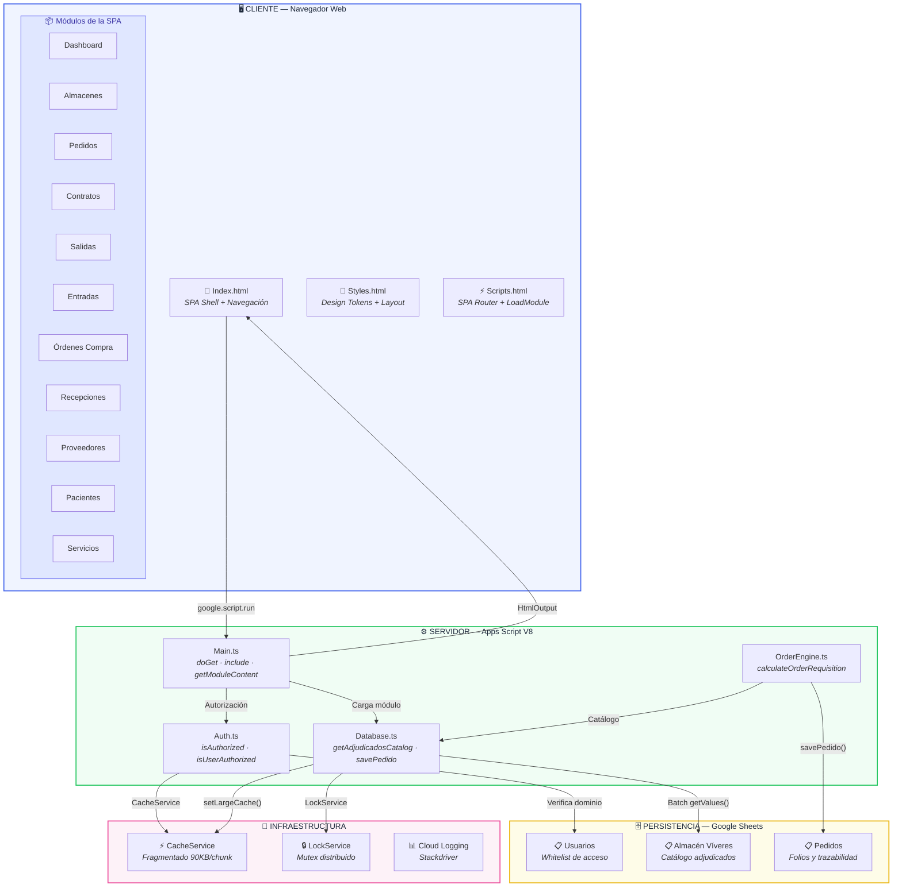
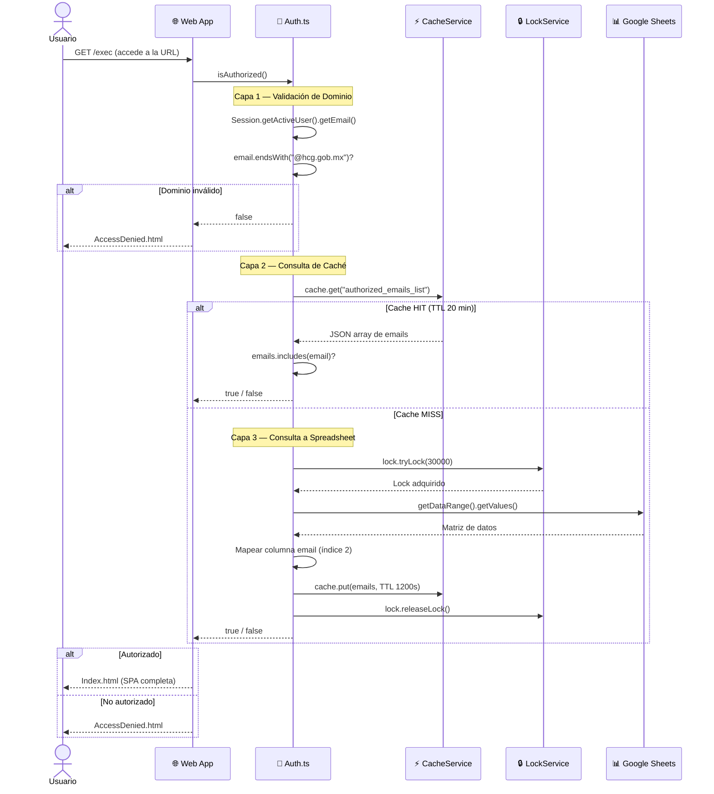
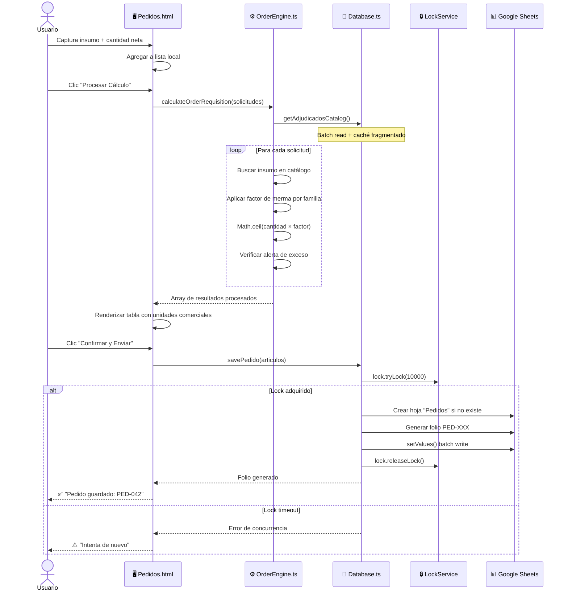
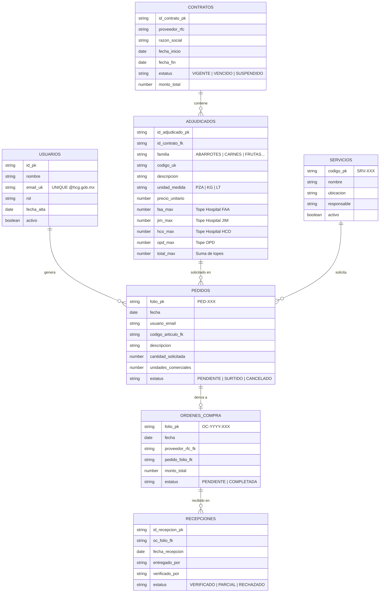
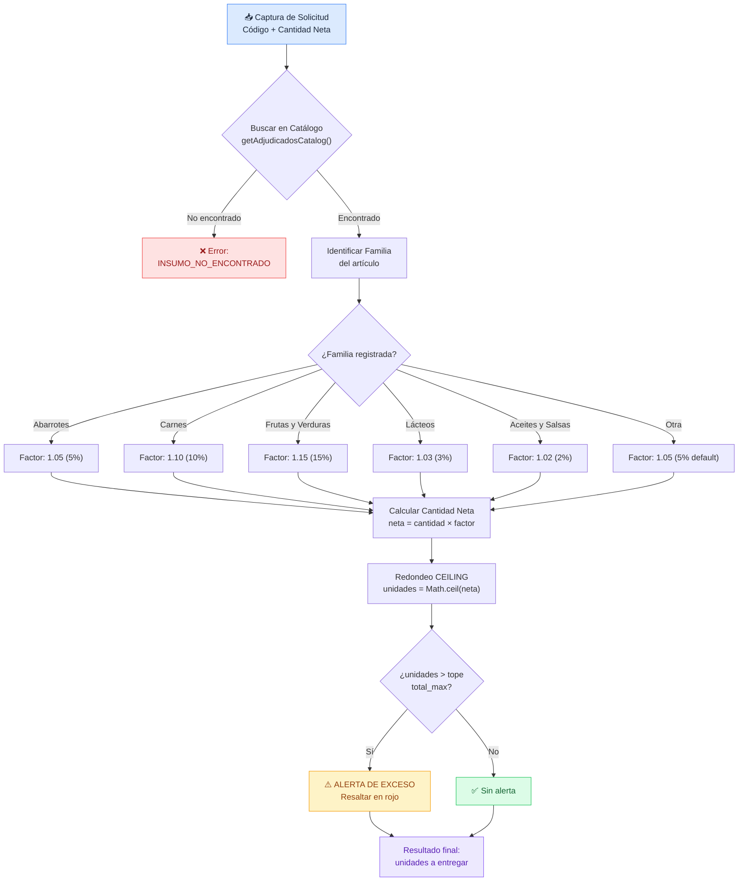
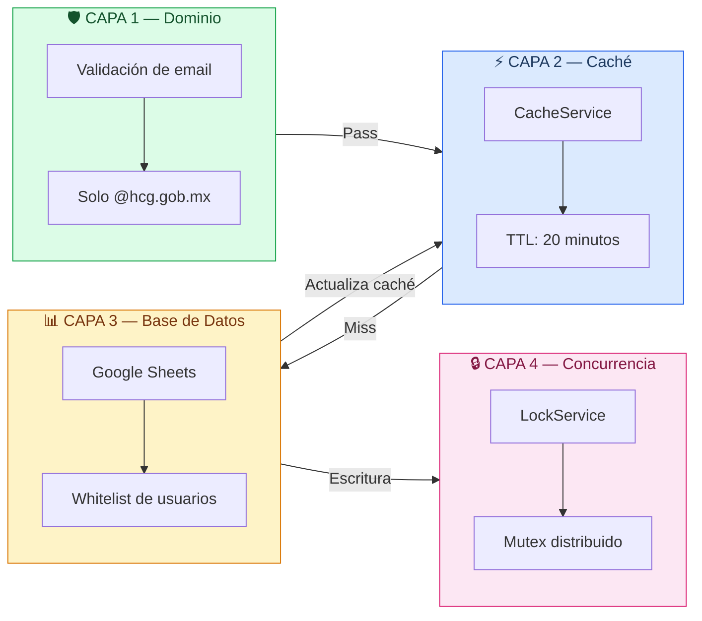
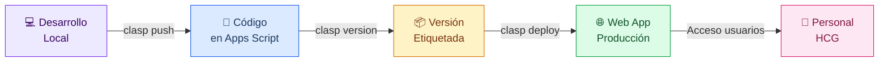
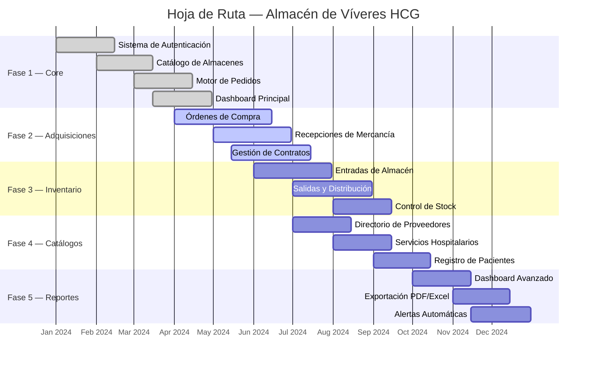

<div align="center">

<!-- Banner -->


# 🏥 Almacén de Víveres — HCG

### Sistema Integral de Gestión de Abastecimiento Hospitalario

**Organismo Público Descentralizado · Hospital Civil de Guadalajara**

<br>


<br>

**Aplicación web SPA** desplegada como Web App de Google Apps Script para la gestión integral de insumos alimenticios, contratos de adjudicación, órdenes de compra y logística del almacén de víveres del Hospital Civil de Guadalajara.

<br>

<a href="#-visión-general">Visión General</a> · <a href="#-arquitectura">Arquitectura</a> · <a href="#-módulos">Módulos</a> · <a href="#-base-de-datos">Base de Datos</a> · <a href="#-seguridad">Seguridad</a> · <a href="#-despliegue">Despliegue</a> · <a href="#-roadmap">Roadmap</a>

</div>

<br>

---

## 📑 Índice

<details open>
<summary><strong>Navegación Rápida</strong></summary>

- [Visión General](#-visión-general)
- [Stack Tecnológico](#-stack-tecnológico)
- [Arquitectura del Sistema](#-arquitectura-del-sistema)
- [Estructura del Repositorio](#-estructura-del-repositorio)
- [Módulos Funcionales](#-módulos-funcionales)
- [Modelo de Datos](#-modelo-de-datos)
- [Flujo de Pedidos](#-flujo-de-pedidos)
- [Rendimiento y Optimización](#-rendimiento-y-optimización)
- [Seguridad](#-seguridad)
- [Requisitos Previos](#-requisitos-previos)
- [Instalación y Configuración](#-instalación-y-configuración)
- [Despliegue](#-despliegue)
- [Referencia de Comandos](#-referencia-de-comandos)
- [API del Servidor](#-api-del-servidor)
- [Roadmap](#-roadmap)
- [Contribución](#-contribución)
- [Solución de Problemas](#-solución-de-problemas)
- [Licencia](#-licencia)

</details>

---

## 🔭 Visión General

### ¿Qué es?

**Almacén de Víveres — HCG** es un sistema web de administración hospitalaria diseñado para optimizar la cadena de abastecimiento del almacén de víveres del Hospital Civil de Guadalajara. Permite controlar el inventario de alimentos adjudicados, generar pedidos con cálculo automático de merma, gestionar contratos con proveedores y dar seguimiento a órdenes de compra y recepciones.

### ¿Por qué Google Apps Script?

| Decisión de Diseño | Beneficio |
|:---|:---|
| **Zero infraestructura** | No requiere servidores, Docker ni configuración de red — se ejecuta en la nube de Google |
| **Autenticación nativa** | OAuth 2.0 integrado con Google Workspace, sin gestión de sesiones manual |
| **Persistencia gratuita** | Google Sheets como base de datos transaccional con límites ampliamente suficientes |
| **Despliegue instantáneo** | `clasp push` → producción en segundos, sin pipelines CI/CD complejos |
| **Acceso institucional** | Los usuarios acceden con sus cuentas `@hcg.gob.mx` existentes |

### Flujo de Valor

```
┌─────────────────────────────────────────────────────────────────────────────┐
│                                                                             │
│   Solicitud        Cálculo           Validación       Generación            │
│   de Insumo   ──▶  de Merma     ──▶  de Límites  ──▶  de Folio             │
│   (Servicio)       (Automático)       (Alertas)       (BD)                  │
│                                                                             │
│   ────────────────────────────────────────────────────────────────────────  │
│                                                                             │
│   Captura          Algoritmo          Comparación      Registro             │
│   manual de        CEILING por        contra máximos   atómico con          │
│   cantidades       categoría          por almacén      LockService          │
│   netas            (merma %)          (FAA/JIM/HCO)    (folio PED-XXX)      │
│                                                                             │
└─────────────────────────────────────────────────────────────────────────────┘
```

---

## 🛠 Stack Tecnológico

<br>

```
╔══════════════════════════════════════════════════════════════════════════════╗
║                           CAPA DE PRESENTACIÓN                             ║
║                                                                            ║
║   HTML5 · CSS3 (Design Tokens) · Vanilla JavaScript · SVG Icons            ║
║   SPA Navigation · Animaciones CSS · Responsive Design                     ║
╠══════════════════════════════════════════════════════════════════════════════╣
║                           CAPA DE COMUNICACIÓN                             ║
║                                                                            ║
║   google.script.run (RPC Asíncrono) · HtmlService · Template Scriptlets    ║
╠══════════════════════════════════════════════════════════════════════════════╣
║                           CAPA DEL SERVIDOR                                ║
║                                                                            ║
║   TypeScript (strict) · Google Apps Script V8 Engine (ES2019+)             ║
║   HtmlService · Session · LockService · CacheService                       ║
╠══════════════════════════════════════════════════════════════════════════════╣
║                           CAPA DE PERSISTENCIA                             ║
║                                                                            ║
║   Google Sheets · Batch Read/Write · Cache Fragmentado                     ║
╠══════════════════════════════════════════════════════════════════════════════╣
║                           HERRAMIENTAS                                     ║
║                                                                            ║
║   @google/clasp · TypeScript Compiler · Google Cloud Logging               ║
╚══════════════════════════════════════════════════════════════════════════════╝
```

<br>

<details>
<summary><strong>📦 Detalle de Herramientas y Dependencias</strong></summary>

<br>

| Herramienta | Versión | Propósito |
|:---|:---|:---|
| **@google/clasp** | 2.4+ | CLI para push/pull, gestión de versiones y despliegues |
| **TypeScript** | 5.x | Tipado estático, interfaces, enums, y transpilación a `.gs` |
| **Google Apps Script** | V8 Runtime | Servidor serverless con soporte ES2019+ |
| **Google Sheets** | — | Motor de base de datos transaccional (batch R/W) |
| **CacheService** | — | Caché en memoria con TTL configurable y fragmentación |
| **LockService** | — | Mutex distribuido para control de concurrencia |
| **HtmlService** | — | Renderizado de plantillas HTML con scriptlets del servidor |
| **Google Cloud Logging** | — | Monitoreo, trazabilidad y auditoría de errores |

</details>

---

## 🏗 Arquitectura del Sistema

### Diagrama de Componentes



### Diagrama de Secuencia — Autenticación



### Diagrama de Secuencia — Generación de Pedido



---

## 📂 Estructura del Repositorio

```
📦 almacen-viveres/
├── 📄 README.md                          # Documentación del proyecto
├── 📄 .gitignore                         # Reglas de exclusión de Git
│
└── 📂 src/                               # ── Código fuente ─────────────────────
    ├── 📄 appsscript.json                # Manifiesto GAS (OAuth scopes, runtime V8)
    │
    ├── 📄 Main.ts                        # Entry point: doGet(), include(), getModuleContent()
    ├── 📄 Auth.ts                        # Autenticación: dominio + caché + spreadsheet
    ├── 📄 Database.ts                    # Acceso a datos: batch R/W + caché fragmentado
    │
    ├── 📂 Services/                      # ── Lógica de Negocio ──────────────────
    │   └── 📄 OrderEngine.ts             # Motor de cálculo de requisiciones (merma)
    │
    └── 📂 ui/                            # ── Capa de Presentación ───────────────
        ├── 📄 Index.html                 # Shell principal de la SPA (sidebar + topbar)
        ├── 📄 Styles.html                # Design tokens + layout global (CSS)
        ├── 📄 Scripts.html               # SPA router (loadModule via google.script.run)
        ├── 📄 AccessDenied.html          # Página de acceso denegado con cambio de cuenta
        │
        └── 📂 modules/                   # ── Módulos de la SPA ──────────────────
            ├── 📄 Dashboard.html         # ✅ Panel principal con KPIs y módulos
            ├── 📄 Almacenes.html         # ✅ Catálogo adjudicado con filtros + modal
            ├── 📄 Pedidos.html           # ✅ Captura + cálculo de merma + confirmación
            ├── 📄 OrdenesCompra.html     # 🚧 Gestión de órdenes de adquisición
            ├── 📄 Recepciones.html       # 🚧 Recepción física de mercancía
            ├── 📄 Proveedores.html       # 🚧 Directorio de proveedores
            ├── 📄 Servicios.html         # 🚧 Catálogo de servicios hospitalarios
            ├── 📄 Pacientes.html         # 🚧 Registro de pacientes beneficiarios
            ├── 📄 Contratos.html         # 🔧 Scaffold en desarrollo
            ├── 📄 Entradas.html          # 🔧 Scaffold en desarrollo
            └── 📄 Salidas.html           # 🔧 Scaffold en desarrollo
```

**Leyenda de estados:**
- ✅ **Activo** — Funcionalidad completa y operativa
- 🚧 **En desarrollo** — UI funcional con datos de ejemplo, pendiente integración con backend
- 🔧 **Scaffold** — Estructura base, pendiente de implementación

---

## 📦 Módulos Funcionales

<br>

### Dashboard

> Panel principal de la aplicación. Muestra un saludo contextual (buenos días/tardes/noches), módulos accesibles como tarjetas interactivas con efecto ripple, y un panel de actividad reciente.

| Característica | Detalle |
|:---|:---|
| **Archivo** | `Dashboard.html` |
| **Estado** | ✅ Activo |
| **Interacciones** | Cards con hover, ripple effect, navegación SPA |
| **Responsive** | Grid adaptable (1-3 columnas según viewport) |
| **Accesibilidad** | `role="list"`, `tabindex`, `aria-label`, `prefers-reduced-motion` |

### Almacenes

> Catálogo de artículos adjudicados con búsqueda en tiempo real, filtrado por familia alimentaria, ordenamiento por columnas y modal de detalle con distribución por almacén (FAA, JIM, HCO).

| Característica | Detalle |
|:---|:---|
| **Archivo** | `Almacenes.html` |
| **Estado** | ✅ Activo |
| **Backend** | `Database.ts → getAdjudicadosCatalog()` |
| **Datos** | Batch read desde Google Sheets con caché fragmentado (1h TTL) |
| **Búsqueda** | Debounce 200ms, código o descripción |
| **Filtros** | Select dinámico por familia alimentaria |
| **Modal** | Detalle con distribución FAA/JIM/HCO + barra proporcional |
| **Skeleton** | Loading state con shimmer animation |

### Pedidos

> Motor de captura y cálculo de requisiciones. Los usuarios ingresan cantidades netas de insumos y el sistema calcula automáticamente las unidades comerciales a entregar aplicando factores de merma.

| Característica | Detalle |
|:---|:---|
| **Archivo** | `Pedidos.html` |
| **Estado** | ✅ Activo |
| **Backend** | `OrderEngine.ts → calculateOrderRequisition()` + `Database.ts → savePedido()` |
| **Algoritmo** | CEILING(cantidad × factor_merma) por categoría |
| **Factores** | Abarrotes 5%, Carnes 10%, Frutas/Verduras 15%, Lácteos 3%, Aceites 2% |
| **Alertas** | Resalta artículos que superan el límite máximo por almacén |
| **Persistencia** | Folio autoincremental `PED-XXX` con LockService |

### Módulos en Desarrollo

| Módulo | Descripción | Prioridad |
|:---|:---|:---|
| **Órdenes de Compra** | Generación de OC a proveedores adjudicados | 🔴 Alta |
| **Recepciones** | Verificación de mercancía recibida contra OC | 🔴 Alta |
| **Contratos** | Gestión de contratos de adjudicación vigentes | 🟡 Media |
| **Entradas** | Registro de ingreso de mercancía al almacén | 🟡 Media |
| **Salidas** | Registro de distribución a servicios hospitalarios | 🟡 Media |
| **Proveedores** | Directorio de proveedores y contratistas | 🟢 Baja |
| **Servicios** | Catálogo de servicios/departamentos hospitalarios | 🟢 Baja |
| **Pacientes** | Registro de pacientes vinculados a consumos | 🟢 Baja |

---

## 🗄 Modelo de Datos

### Diagrama Entidad-Relación



### Estructura de Hojas en Google Sheets

<details>
<summary><strong>📋 Detalle de columnas por hoja</strong></summary>

<br>

**Hoja: Usuarios** (`SS_ID: 1pvbHuJh...`)

| Columna | Índice | Contenido |
|:---|:---|:---|
| A | 0 | ID |
| B | 1 | Nombre completo |
| C | 2 | **Email institucional** (campo clave de auth) |
| D | 3 | Rol / Área |

**Hoja: Adjudicados** (`DB_ALMV_ID: 1cAy768H...`)

| Columna | Índice | Contenido |
|:---|:---|:---|
| A | 0 | ID Adjudicado |
| B | 1 | ID Contrato |
| C | 2 | Familia alimentaria |
| D | 3 | Código del artículo |
| E | 4 | Descripción |
| F | 5 | Unidad de medida |
| G | 6 | Precio unitario |
| H-I | 7-8 | **Tope FAA** (col 8 = valor) |
| J-K | 9-10 | **Tope JIM** (col 10 = valor) |
| L-M | 11-12 | **Tope HCO** (col 12 = valor) |
| N-O | 13-14 | **Tope OPD** (col 14 = valor) |
| P-Q | 15-16 | **Total Máximo** (col 16 = valor) |

**Hoja: Pedidos** (creada dinámicamente)

| Columna | Contenido |
|:---|:---|
| Folio | `PED-XXX` autoincremental |
| Fecha | Timestamp de creación |
| Usuario | Email del solicitante |
| Código | Articulo solicitado |
| Descripción | Nombre del artículo |
| Cantidad Solicitada | Cantidad neta ingresada |
| Unidades Comerciales | Calculada con factor de merma |
| Estatus | `PENDIENTE` |

</details>

---

## 📊 Flujo de Pedidos

### Algoritmo de Cálculo de Merma



### Ejemplo Práctico

```
┌─────────────────────────────────────────────────────────────────┐
│  Solicitud:  Manzana Golden, 10 unidades netas                  │
│  Familia:    FRUTAS Y VERDURAS                                  │
│  Factor:     1.15 (15% merma)                                   │
│                                                                 │
│  Cálculo:   10 × 1.15 = 11.5 → CEILING = 12 unidades           │
│  Tope HCO:  20 unidades                                         │
│  Resultado: ✅ 12 unidades a entregar (sin alerta)              │
├─────────────────────────────────────────────────────────────────┤
│  Solicitud:  Filete de Res, 50 unidades netas                   │
│  Familia:    CARNES                                             │
│  Factor:     1.10 (10% merma)                                   │
│                                                                 │
│  Cálculo:   50 × 1.10 = 55 → CEILING = 55 unidades             │
│  Tope HCO:  40 unidades                                         │
│  Resultado: ⚠️ 55 unidades (EXCEDE TOPE de 40)                 │
└─────────────────────────────────────────────────────────────────┘
```

---

## ⚡ Rendimiento y Optimización

### Patrones Implementados

<br>

#### 1. Batch Read/Write — Cero llamadas a API en bucles

```
┌──────────────────────────────────────────────────────────────────┐
│  ❌ ANTI-PATRÓN                ✅ PATRÓN CORRECTO                │
│                                                                  │
│  for (i = 0; i < n; i++)      const data = sheet                │
│    sheet.getRange(i)             .getDataRange()                 │
│      .getValue(); // N calls       .getValues(); // 1 call       │
│                                                                  │
│  N llamadas a la API           1 sola llamada a la API           │
│  ~100ms × N = lento            ~100ms total = rápido             │
└──────────────────────────────────────────────────────────────────┘
```

#### 2. Caché Fragmentado — Payloads mayores a 100 KB

```
┌──────────────────────────────────────────────────────────────────┐
│  CacheService limit: 100 KB por clave                           │
│                                                                  │
│  Datos grandes (ej: catálogo completo)                          │
│       │                                                          │
│       ▼                                                          │
│  ┌─────────┐ ┌─────────┐ ┌─────────┐                           │
│  │ Chunk 0 │ │ Chunk 1 │ │ Chunk 2 │  ← 90 KB c/u             │
│  │  90 KB  │ │  90 KB  │ │  50 KB  │                           │
│  └─────────┘ └─────────┘ └─────────┘                           │
│       │          │           │                                   │
│       ▼          ▼           ▼                                   │
│  cache.put(key_0)  cache.put(key_1)  cache.put(key_2)          │
│  cache.put(key_count, "3")  ← Metadata                          │
│                                                                  │
│  Lectura: get count → concatenar chunks → JSON.parse            │
│  TTL: 3600 segundos (1 hora)                                    │
└──────────────────────────────────────────────────────────────────┘
```

#### 3. Concurrencia Segura con LockService

```
┌──────────────────────────────────────────────────────────────────┐
│  Usuario A              Usuario B              Usuario C         │
│      │                      │                      │            │
│      ▼                      ▼                      ▼            │
│  tryLock(10s)           tryLock(10s)           tryLock(10s)     │
│      │                      │                      │            │
│  ✅ Lock adquirido       ⏳ Esperando...        ⏳ Esperando... │
│      │                      │                      │            │
│  [Escritura atómica]        │                      │            │
│      │                      │                      │            │
│  releaseLock()              │                      │            │
│      │                      ▼                      │            │
│      │               ✅ Lock adquirido          ⏳ Esperando... │
│      │                      │                      │            │
│      │               [Escritura atómica]           │            │
│      │                      │                      │            │
│      │               releaseLock()                  │            │
│      │                      │                      ▼            │
│      │                      │               ✅ Lock adquirido   │
│      │                      │                      │            │
│      │                      │               [Escritura atómica] │
│      │                      │                      │            │
│      │                      │               releaseLock()       │
└──────────────────────────────────────────────────────────────────┘
```

---

## 🔐 Seguridad

### Modelo de Defensa en Profundidad



### Scopes de OAuth

```json
[
  "https://www.googleapis.com/auth/spreadsheets.currentonly",
  "https://www.googleapis.com/auth/spreadsheets",
  "https://www.googleapis.com/auth/userinfo.email",
  "https://www.googleapis.com/auth/script.external_request"
]
```

> [!IMPORTANT]
> Los scopes están configurados con el **mínimo privilegio necesario**. `spreadsheets.currentonly` limita el acceso al libro vinculado. No agregar scopes adicionales sin auditoría de seguridad.

### Políticas de Seguridad

| Política | Implementación |
|:---|:---|
| **Autenticación** | OAuth 2.0 institucional via Google Workspace |
| **Autorización** | Whitelist en Spreadsheet + filtrado por dominio |
| **Caché de sesión** | Lista de emails autorizados con TTL de 20 min |
| **Concurrencia** | `LockService.getScriptLock()` con timeout de 30s |
| **Auditoría** | `console.log` estructurado (JSON) → Cloud Logging |
| **XSS** | `HtmlService` sanitiza automáticamente el output |
| **Clickjacking** | `XFrameOptionsMode.ALLOWALL` controlado por GAS |
| **Datos sensibles** | IDs de Spreadsheet no expuestos en frontend |

---

## 📋 Requisitos Previos

<br>

| Requisito | Versión | Verificación |
|:---|:---|:---|
| **Node.js** | ≥ 18 LTS | `node --version` |
| **npm** | ≥ 9.x | `npm --version` |
| **@google/clasp** | ≥ 2.4 | `clasp --version` |
| **Cuenta Google** | — | Dominio `@hcg.gob.mx` |
| **Apps Script API** | Habilitada | [script.google.com/home/usersettings](https://script.google.com/home/usersettings) |

---

## 🚀 Instalación y Configuración

### Paso 1 — Clonar el repositorio

```bash
git clone https://github.com/jlangarica/almacen-viveres.git
cd almacen-viveres
```

### Paso 2 — Instalar Clasp globalmente

```bash
npm install -g @google/clasp
```

### Paso 3 — Autenticarse con Google

```bash
clasp login
```

> Se abrirá el navegador para autorizar el acceso a tu cuenta de Google institucional.

### Paso 4 — Vincular al proyecto de Apps Script

**Opción A:** Crear un nuevo proyecto:

```bash
clasp create --title "Almacén de Víveres HCG" --type sheets --rootDir ./src
```

**Opción B:** Vincular a un proyecto existente — editar `.clasp.json`:

```json
{
  "scriptId": "TU_SCRIPT_ID_AQUI",
  "rootDir": "./src"
}
```

### Paso 5 — Verificar la conexión

```bash
clasp status
```

Deberías ver los archivos listados:

```
├── src/appsscript.json
├── src/Main.ts
├── src/Auth.ts
├── src/Database.ts
├── src/Services/OrderEngine.ts
├── src/ui/Index.html
├── src/ui/Styles.html
├── src/ui/Scripts.html
├── src/ui/AccessDenied.html
└── src/ui/modules/*.html
```

### Paso 6 — Subir al servidor

```bash
clasp push
```

---

## 📤 Despliegue



### Comandos de Despliegue

```bash
# Subir código local → Apps Script
clasp push

# Abrir en el editor web de Apps Script
clasp open

# Crear una versión etiquetada
clasp version "v1.2.0 — Motor de merma con alertas"

# Crear un nuevo deployment
clasp deploy --description "v1.2.0 — Producción"

# Listar deployments activos
clasp deployments

# Ver logs en tiempo real
clasp logs --watch
```

> [!TIP]
> Después de `clasp deploy`, configurar el acceso en **Publicar → Implementar como aplicación web** desde el editor de Apps Script. Seleccionar: *Ejecutar como: Yo* · *Acceso: Cualquier usuario del dominio*.

---

## 🧰 Referencia de Comandos

| Comando | Descripción |
|:---|:---|
| `clasp login` | Autenticarse con la cuenta de Google |
| `clasp logout` | Cerrar sesión de Clasp |
| `clasp create --title "..." --type sheets` | Crear nuevo proyecto GAS |
| `clasp clone <scriptId>` | Clonar proyecto GAS existente |
| `clasp push` | Subir código local → Apps Script |
| `clasp pull` | Descargar código del servidor → local |
| `clasp status` | Ver archivos rastreados y estado |
| `clasp open` | Abrir proyecto en editor web |
| `clasp logs` | Ver logs de Stackdriver |
| `clasp logs --watch` | Logs en tiempo real |
| `clasp version "msg"` | Crear versión con descripción |
| `clasp deploy -d "msg"` | Crear nuevo deployment |
| `clasp deployments` | Listar deployments activos |
| `clasp undeploy <id>` | Eliminar un deployment |
| `clasp run <function>` | Ejecutar función remotamente |

---

## 📡 API del Servidor

Las siguientes funciones están expuestas al cliente via `google.script.run`:

<br>

### `doGet(e)`

| | |
|:---|:---|
| **Archivo** | `Main.ts` |
| **Parámetros** | `e` — Evento HTTP de Apps Script |
| **Retorna** | `HtmlOutput` — Index.html o AccessDenied.html |
| **Descripción** | Entry point de la Web App. Verifica autorización antes de servir contenido. |

### `include(filename)`

| | |
|:---|:---|
| **Archivo** | `Main.ts` |
| **Parámetros** | `filename` (string) — Ruta del archivo a incluir |
| **Retorna** | `string` — Contenido HTML del archivo |
| **Descripción** | Inyecta CSS y JS en las plantillas via scriptlets `<?!= include('...'); ?>`. |

### `getModuleContent(filename)`

| | |
|:---|:---|
| **Archivo** | `Main.ts` |
| **Parámetros** | `filename` (string) — Nombre del módulo (ej: `"Almacenes"`) |
| **Retorna** | `string` — HTML renderizado del módulo |
| **Descripción** | Carga dinámica de módulos SPA via `google.script.run`. |

### `getAdjudicadosCatalog()`

| | |
|:---|:---|
| **Archivo** | `Database.ts` |
| **Parámetros** | Ninguno |
| **Retorna** | `Array<Adjudicado>` — Catálogo de artículos adjudicados |
| **Caché** | Fragmentado, TTL 1 hora |
| **Descripción** | Lee el catálogo completo desde Google Sheets con batch read y caché. |

### `calculateOrderRequisition(solicitudes)`

| | |
|:---|:---|
| **Archivo** | `OrderEngine.ts` |
| **Parámetros** | `solicitudes` — `Array<{codigo, cantidadSolicitada}>` |
| **Retorna** | `Array<Resultado>` — Artículos con unidades comerciales calculadas |
| **Descripción** | Aplica factores de merma y algoritmo CEILING por categoría. |

### `savePedido(articulos)`

| | |
|:---|:---|
| **Archivo** | `Database.ts` |
| **Parámetros** | `articulos` — Array de artículos procesados |
| **Retorna** | `string` — Folio generado (ej: `"PED-042"`) |
| **Lock** | `LockService` con timeout de 10s |
| **Descripción** | Persiste el pedido con folio autoincremental y escritura batch. |

### `isAuthorized()` / `isUserAuthorized(email)`

| | |
|:---|:---|
| **Archivo** | `Auth.ts` |
| **Parámetros** | `email` (opcional) — Email a verificar |
| **Retorna** | `boolean` |
| **Descripción** | Verificación en 3 capas: dominio → caché → spreadsheet. |

### `getUserEmail()`

| | |
|:---|:---|
| **Archivo** | `Auth.ts` |
| **Parámetros** | Ninguno |
| **Retorna** | `string` — Email del usuario activo |
| **Descripción** | Wrapper para `Session.getActiveUser().getEmail()`. |

---

## 🗺 Roadmap



---

## 🤝 Contribución

### Flujo de Trabajo

```mermaid
gitgraph
    commit id: "init: proyecto base"
    branch feature/ordenes-compra
    checkout feature/ordenes-compra
    commit id: "feat: scaffold OC"
    commit id: "feat: tabla + filtros"
    commit id: "feat: integración backend"
    commit id: "test: validación manual"
    checkout main
    merge feature/ordenes-compra id: "merge: OC module"
    commit id: "release: v1.1.0"
    branch feature/recepciones
    checkout feature/recepciones
    commit id: "feat: scaffold recepciones"
    commit id: "feat: verificación OC"
    checkout main
    merge feature/recepciones id: "merge: recepciones"
    commit id: "release: v1.2.0"
```

### Convenciones de Commits

Especificación [Conventional Commits](https://www.conventionalcommits.org/):

| Prefijo | Uso | Ejemplo |
|:---|:---|:---|
| `feat:` | Nueva funcionalidad | `feat: agregar filtro por familia` |
| `fix:` | Corrección de errores | `fix: corregir cálculo de merma` |
| `refactor:` | Refactorización | `refactor: extraer lógica de caché` |
| `docs:` | Documentación | `docs: actualizar README` |
| `style:` | Formateo | `style: corregir indentación` |
| `perf:` | Rendimiento | `perf: optimizar batch read` |
| `chore:` | Mantenimiento | `chore: actualizar .gitignore` |

### Estándares de Código

| Estándar | Detalle |
|:---|:---|
| **Principios** | SOLID y DRY estrictos |
| **Documentación** | JSDoc obligatorio en toda función exportada |
| **Naming** | `camelCase` variables/funciones · `PascalCase` clases |
| **Rendimiento** | Cero llamadas a API dentro de bucles — siempre batch |
| **Concurrencia** | `LockService` obligatorio en mutaciones compartidas |
| **Caché** | Fragmentación automática para payloads > 100 KB |
| **Logging** | Objetos JSON estructurados para Cloud Logging |

> [!WARNING]
> **No** modificar `appsscript.json` sin autorización explícita. Los scopes de OAuth son auditados institucionalmente.

---

## 🔧 Solución de Problemas

<details>
<summary><strong>❌ "Script function not found" al hacer clasp push</strong></summary>

**Causa:** El runtime V8 no reconoce funciones en archivos `.ts` si hay errores de sintaxis.

**Solución:**
```bash
# Verificar errores de TypeScript
npx tsc --noEmit

# Asegurar que appsscript.json tenga runtime V8
cat src/appsscript.json | grep runtime
# Debe mostrar: "runtimeVersion": "V8"
```

</details>

<details>
<summary><strong>❌ "Argument too large: value" en CacheService</strong></summary>

**Causa:** CacheService tiene un límite de 100 KB por clave.

**Solución:** El sistema ya maneja esto automáticamente con `setLargeCache()` y `getLargeCache()`. Si ocurre, verificar que se estén usando estas funciones y no `cache.put()` directamente.

</details>

<details>
<summary><strong>❌ "Lock timeout" al guardar pedidos</strong></summary>

**Causa:** Otro proceso tiene el lock activo.

**Solución:**
```typescript
// El timeout actual es de 10 segundos
if (lock.tryLock(10000)) { ... }
// Si persiste, incrementar a 30000 (30s)
```

</details>

<details>
<summary><strong>❌ Los usuarios no pueden acceder</strong></summary>

**Causa:** El email no está en la whitelist o el dominio es incorrecto.

**Verificación:**
1. Confirmar que el email termine en `@hcg.gob.mx`
2. Verificar que el email exista en la hoja "Usuarios" del Spreadsheet de autenticación
3. Esperar 20 minutos (TTL de caché) o forzar recarga limpiando `CacheService`

</details>

<details>
<summary><strong>❌ clasp push falla sin errores</strong></summary>

**Causa:** `.clasp.json` no existe o tiene un `scriptId` incorrecto.

**Solución:**
```bash
# Verificar configuración
cat .clasp.json

# Si no existe, crear con el scriptId correcto
echo '{"scriptId":"TU_SCRIPT_ID","rootDir":"./src"}' > .clasp.json
```

</details>

---

## 📄 Licencia

Este proyecto es de **uso institucional** del Organismo Público Descentralizado Hospital Civil de Guadalajara. No está sujeto a una licencia open-source estándar.

Para consultas sobre uso, acceso o modificación, contactar al área de sistemas del HCG.

---

<br>

<div align="center">

### 🏥 Hospital Civil de Guadalajara

**Organismo Público Descentraliado**

*Sistema desarrollado con estándares de ingeniería de software de nivel empresarial.*

<br>

`TypeScript` · `Google Apps Script V8` · `SOLID` · `Clean Code` · `Batch R/W` · `Defensa en Profundidad`

<br>


</div>
